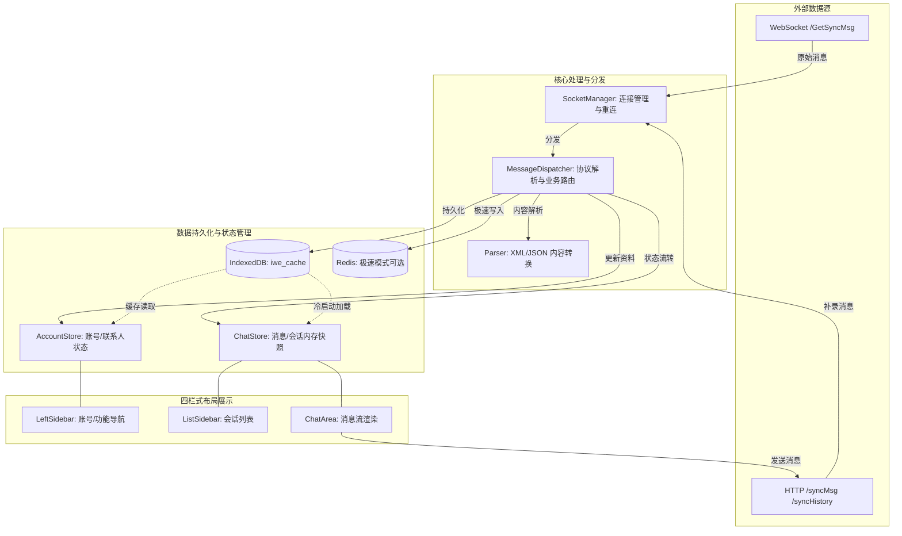

# PROJECT_MAP - 项目 Wiki & 架构全景

## 1. 核心功能目录说明
*   `iwe-web/src/api`: 接口定义层，包含 `admin` (管理接口) 和 `im` (即时通讯相关接口)。
*   `iwe-web/src/components`: 业务组件库。
    *   `config/`: 后台管理与扫码登录相关组件。
    *   `login/`: 包含 62 数据提取、二维码登录、唤醒登录等多种登录逻辑组件。
    *   核心 UI: `ChatArea.vue` (聊天主区), `ListSidebar.vue` (会话列表), `LeftSidebar.vue` (功能导航)。
*   `iwe-web/src/composables`: 组合式 API (Hooks)，如 `useVoicePlayer` 处理语音播放。
*   `iwe-web/src/store`: 状态管理中心 (Pinia)。
    *   `account/`: 模块化的账号管理逻辑（资料、联系人、Redis 同步分而治之）。
    *   `chat.ts`: 聊天记录、会话列表的核心流转逻辑。
*   `iwe-web/src/types`: 统一类型定义层，包含 `chat.ts` 等。
*   `iwe-web/src/utils`: 工具函数集，包含网络请求、加密解析、缓存管理等。
*   `iwe-web/src/views`: 页面入口（登录页、主页、配置页）。

## 2. “公共轮子”清单
### 核心工具 (Utils)
*   `request.ts`: 基于 Axios 封装，自动注入 `key` 参数，处理 `Code/Data` 响应外壳。
*   `debug.ts`: 调试开关与内置日志面板工具，提供 `debugLog/debugWarn/debugError` 延迟日志函数；昂贵日志内容应使用 lambda，确保 debug 关闭时不生成日志内容。
*   `contactCache.ts`: **核心持久化方案**，基于 IndexedDB 封装，支持过期清理 (TTL) 和基于 `partnerType` 索引的高效批量清理。
*   `socketManager.ts`: **链路自愈管理器**。采用全局单例模式监听 `online` 和 `visibilitychange` 事件。当用户切回页面或网络恢复时，统一指挥所有连接进行心跳探测或强制重连，并触发 HTTP 补位轮询。
*   `messageDispatcher.ts`: **消息分发枢纽**，负责原始协议特征识别、消息类型判定及业务逻辑路由。
*   `structures.ts`: 通用数据结构工具，如 `BoundedSet` (有界去重集合) 和 `binaryInsert` (二分插入算法)。
*   `parser.ts`: 消息内容解析器（XML/JSON 转换）。
*   `wx62.ts`: 专门处理微信 62 数据格式的工具。

### 业务钩子 (Hooks/Composables)
*   `useVoicePlayer.ts`: 处理 SILK 等音频格式的解码与播放逻辑。
## 3. 业务流向全景 (Data Flow)

## 4. 数据结构/变量字典
### 核心数据模型 (Types: `src/types/chat.ts`)
*   `AppMessage`: 消息对象
    - `id`: 唯一标识 (字符串)
    - `msgId`: 微信原始消息 ID
    - `type`: 消息类型 (text, image, voice, etc.)
    - `content`: 消息文本或解析后的内容
    - `isSelf`: 是否本人发送
    - `partnerId`: 归属的对话伙伴 ID
    - `partnerType`: 伙伴类型 (`individual` | `chatroom` | `official`)
    - `isBigImageLoaded`: 是否已成功拉取高清大图 (布尔值)
*   `Conversation`: 会话摘要
    - `wxid`: 联系人唯一 ID
    - `nickname`: 显示名称
    - `unread`: 未读计数
*   `Account`: 微信账号对象
    - `uuid`: 内部维护的唯一 ID
    - `status`: 在线/离线状态 (`online` | `offline`)

### 数据库表结构 (IndexedDB: `iwe_cache`)
*   `contacts`: 存储联系人详情，主键 `uid_wxid` (账号Uuid + 联系人wxid)。
*   `messages`: 存储历史消息，核心索引：`account_partner` (加速单聊加载), `partnerType` (加速分类清理)。
*   `conversations`: 存储会话列表快照，索引：`accountUuid`。
*   `avatars`: 头像 Base64 缓存。

### 全局状态 (Pinia Store)
*   `AccountStore`: 
    - `accounts`: 当前加载的所有账号列表。
    - `accountContactMaps`: 内存中的联系人查找表，按 `accountUuid` 隔离。
*   `ChatStore`:
    - `accountMessages`: 内存中的消息记录，采用 `BoundedSet` (默认 2000 条) 进行去重。
    - `accountConversations`: 内存中的会话列表镜像。

## 4. 核心逻辑设计决策
*   **极速模式 (Redis Mode)**: 当配置了 Redis 且开启该模式时，系统会跳过本地 IndexedDB 写入，直接从 Redis 读写聊天记录。
*   **分发器解耦**: `SocketManager` 只负责连接维护，具体的消息预处理、联系人同步拦截、去重、解析分发全部交由 `MessageDispatcher` 处理。
*   **索引清理优化**: 在 IndexedDB 的 `messages` 表中引入 `partnerType` 索引，使群消息和公众号消息的批量清理从“全表扫描”优化为“索引定向扫描”，显著提升性能。
*   **二分插入有序流**: 消息进入内存 Store 时使用二分查找插入，确保消息流在内存中始终有序，且性能为 O(log n)。
*   **多维链路自愈**: `SocketManager` 实现了基于浏览器事件的链路主动修复机制。通过监听 `visibilitychange` (页面可见性) 和 `online` (网络恢复)，解决了后台 Tab 节流导致的连接假死问题，通过“探测 + 补位同步”的双重保险确保消息不漏收。
*   **微信大图分片渐进拉取**: 微信 Hook 的 `/message/GetMsgBigImg` 接口不支持单包返回全部超大图像。采用基于 `while` 循环分片迭代下载，在后续分片请求中透传首包返回的 `TotalLen` 保持请求合法，最后利用 `Uint8Array` 合并转化为 Base64 回写。
*   **图片缩略图秒开与静默大图升级**: 在同步推送的 `img_buf` 提取缩略图 Base64 直接渲染，避免页面空白；当用户点击缩略图时，利用 Arco Design 的 `<a-image>` 立即弹窗放大预览缩略图，并在后台静默拉取高清大图替换，借助 Vue 响应式绑定使预览图无缝变清晰。
*   **微信头像 404 自愈与 Redis 回写**: 微信头像 URL 在 CDN 上有 30 天时效性。当过期产生 404 导致破图时，前端组件 (气泡、列表等) 通过 `@error` 进行监听拦截，在后台静默拉取 `forceUpdateContactDetails` 好友最新资料。一旦后端返回并更新本地内存，新头像会自动响应式刷新。在 Redis 模式下，更新会自动通过防抖回写服务 (3秒防抖延迟) 推送保存到 Redis 缓存，实现了零感自愈。
