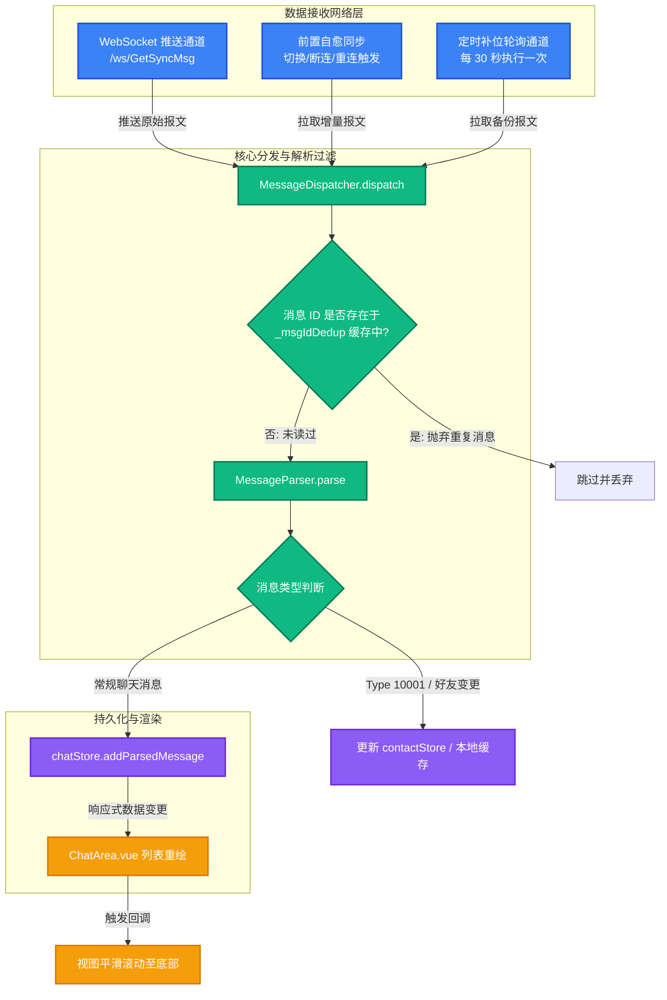

# IWE Web 核心数据流向与时序图分析

本文档详细拆解了 IWE Web 项目中**发送消息**与**接收/同步消息**的核心数据流向，并通过 Mermaid 时序图与流程图进行直观展示。

---

## 核心架构组件一览

在数据流转过程中，以下组件各司其职，形成了高效、稳定的实时通信体系：

| 组件名称 | 物理路径 | 职责 |
| :--- | :--- | :--- |
| **`ChatArea.vue`** | `iwe-web/src/components/ChatArea.vue` | **UI/交互层**：处理用户输入，触发风控（防爆粉）警告拦截弹窗，触发发送事件。 |
| **`Home.vue`** | `iwe-web/src/views/Home.vue` | **协调控制器**：监听 UI 事件，判断运行模式（Demo 模式 / 生产模式），触发接口调用，发起本地消息乐观更新。 |
| **`chat.ts`** | `iwe-web/src/store/chat.ts` | **状态管理器**：维护全局及各账号的聊天记录（`accountMessages`）、会话列表与未读数，提供数据去重缓存。 |
| **`im.ts`** | `iwe-web/src/api/modules/im.ts` | **网络层 (HTTP REST)**：定义发送文本、请求增量/历史消息的后端 Axios 接口。 |
| **`socketManager.ts`** | `iwe-web/src/utils/socketManager.ts` | **网络层 (WS 管理)**：管理多账号 WebSocket 的生命周期，实现断线自愈、前置同步（Poll-Once）和后台补位轮询（30s）。 |
| **`websocket.ts`** | `iwe-web/src/utils/websocket.ts` | **网络层 (WS 驱动)**：封装原生 WebSocket，实现心跳 PING-PONG 与指数退避重连。 |
| **`messageDispatcher.ts`**| `iwe-web/src/utils/messageDispatcher.ts` | **消息路由器**：过滤心跳与非展示消息，对消息进行去重（`_msgIdDedup`），转发到解析器，并最终写入 Store。 |
| **`parser.ts`** | `iwe-web/src/utils/parser.ts` | **数据解析器**：将后端的原始协议数据结构标准化为前端统一的 `Message` 接口格式。 |

---

## 1. 发送消息时序图 (Message Sending Flow)

展示用户在输入框中敲击回车，到消息流向后端服务器，并乐观更新本地界面的完整过程。

```mermaid
sequenceDiagram
    autonumber
    actor User as 用户
    participant ChatArea as ChatArea.vue<br/>(UI层)
    participant Home as Home.vue<br/>(控制器)
    participant chatStore as chat.ts<br/>(Store状态层)
    participant imApi as im.ts<br/>(HTTP 接口)
    participant Backend as 微信控制台后端

    User->>ChatArea: 输入文本并敲击回车 / 点击发送按钮
    
    rect rgb(30, 41, 59)
        note over ChatArea: 【安全防线：防爆粉风控拦截】
        ChatArea->>ChatArea: 检查对方是否非好友关系
        alt 检测为非好友
            ChatArea-->>User: 弹出 Modal.warning 风控警告弹窗
            User->>ChatArea: 确认发送 (OK)
        end
    end

    ChatArea->>Home: emit("sendMessage", text)
    
    rect rgb(15, 23, 42)
        note over Home: 【路由分流：Demo仿真 vs 真实网络】
        alt 运行模式 == "Demo 模式"
            Home->>chatStore: addParsedMessage(userName, msgObj) [本地乐观更新]
            chatStore-->>ChatArea: 响应式更新 UI (消息列表出现自己发送的消息)
            Note over Home: 模拟 1 秒网络延迟...
            Home->>chatStore: addParsedMessage(userName, mockReplyObj) [添加系统仿真自动回复]
            chatStore-->>ChatArea: 响应式更新 UI (对方回复消息)
        else 运行模式 == "真实多开模式"
            Home->>imApi: messageApi.sendText(sessionKey, partnerId, text)
            imApi->>Backend: HTTP POST /message/SendTextMessage
            Backend-->>imApi: 200 OK (发送成功回执)
            Home->>chatStore: addParsedMessage(userName, msgObj) [本地乐观更新]
            chatStore-->>ChatArea: 响应式更新 UI (消息状态变为已发送)
        end
    end
    
    ChatArea->>ChatArea: scrollToBottom() [视窗自动滚动到底部]
```

---

## 2. 接收与同步消息数据流向图 (Message Synchronization & Receiving)

IWE 采用 **双通道融合机制**：以极速的 **WebSocket 推送**为主，并配以**前置自愈同步（Poll Once）**与**后台定时补位轮询（Polling）**，确保在复杂网络、切后台、唤醒等场景下消息“零丢失”。

---

## 3. 架构设计亮点解析

> [!TIP]
> ### 1. 独创的“先连后补”去重算法（De-duplication Cache）
> 为了在极速高并发下保证绝对的消息一致性，`MessageDispatcher` 在内部维护了一个 `_msgIdDedup` Set。不管是 WebSocket 推送来的、还是后台 30s 轮询来、亦或是重连后增量补件拉取来的消息，只要 `NewMsgId` 重合，就会被瞬间过滤。这完美解决了“多源消息流”合并时容易出现的 UI 消息加倍/抖动问题。

> [!IMPORTANT]
> ### 2. 链路自愈与环境自适应能力
> `GlobalSocketManager` 深度集成了浏览器的底层事件：
> - **网络上线事件 (`online`)**：自动重连所有处于断开状态的账号 WS。
> - **页面可见性变更 (`visibilitychange` -> visible)**：用户从其他应用切回浏览器（或者手机唤醒）时，主动执行一次 `PollOnce` 补漏同步，并向 WS 通道发送 `PING` 探测假死，确保休眠期间的消息瞬间补齐。

> [!WARNING]
> ### 3. 嵌入式安全风控防线
> 在发送链路中，UI 层不是盲目将数据递交给 API，而是通过关系校验（`relationLabel`）识别当前对话是否满足安全好友标准。对非正常关系进行风控预警弹窗强拦截，大幅减少了批量多开账号时由于业务人员误操作导致微信号被风控封禁的概率。
