# 微信 62 数据与事件驱动账户状态集成技术文档

我们已成功实现了微信 62 环境数据自动提取、冷启动后台同步、登录环境唤醒、**多账号本地存储严格隔离**，以及**高性能事件驱动型账户状态检测系统**。

---

## 🛠️ 系统交互与架构设计

```mermaid
sequenceDiagram
    participant App as 应用启动 (Cold Start)
    participant User as 前端界面 (UI)
    participant Store as Pinia 状态管理 (accountStore)
    participant WS as WebSocket 连接 (IMService)
    participant API as 后端 API 接口 (loginApi)
    participant Browser as 浏览器缓存 (localStorage)

    %% 冷启动流程
    rect rgb(20, 30, 40)
        Note over App,Browser: 冷启动自动保存阶段 (高性能去重)
        App->>Store: 调用 syncAccountsFromServer()
        Store->>API: 检查单账号状态 checkSingleAccountStatus(license)
        API-->>Store: 返回账号 在线/离线 状态
        Store->>Browser: 检查本地是否已存在该账号的 62 数据
        alt 本地已存在缓存数据 或 账号处于离线状态
            Store->>Store: 终止后台请求 (0次冗余网络交互，节省资源)
        else 账号在线 且 本地无缓存
            Store->>API: 发起 get62Data(license) 请求
            API-->>Store: 返回 62 数据原始响应
            Store->>Browser: 保存数据到对应的隔离存储键 (wx_62_data_{license} & wx_62_data_{wxid})
        end
    end

    %% 事件驱动状态流程
    rect rgb(25, 45, 25)
        Note over User,API: 1. 上线检测 (第二列顶部波纹点手动触发)
        User->>User: 点击第二列功能导航栏顶部的状态波纹点
        User->>Store: 触发 checkSingleAccountStatus() (针对当前活跃账号)
        Store->>API: 访问 GET /login/GetLoginStatus
        API-->>Store: 返回最新在线状态 (LoginState)
        Store->>User: 更新第二列状态波纹与第一列头像的荧光边框
    end

    rect rgb(40, 20, 20)
        Note over WS,Store: 2. 离线检测 (WS 断开事件即时感知)
        WS->>WS: 监听到 WebSocket 断开或心跳假死事件
        WS->>Store: 即时触发 checkSingleAccountStatus() 校验
        Store->>API: 访问 GET /login/GetLoginStatus
        API-->>Store: 返回离线状态 (LoginState = 0)
        Store->>Store: 立即将前端 UI 上的账号状态设为 "offline" (离线)
    end
```

---

## 📂 核心代码库更新说明

### 1. ⚡ 高性能事件驱动状态检测系统
为了杜绝高频后台轮询造成的网络堵塞和偶发报错干扰弹窗：
* **彻底禁用后台定时轮询**：全面**删除并清空**了原有的每 30 秒自动执行一次的后台定时状态轮询 (`startStatusPolling`)。
* **WebSocket 断开即时离线校验**：当 WebSocket 检测到断线或假死重连时，会立刻在后台请求一次 `/login/GetLoginStatus` 接口。如果确认失效，UI **秒级变灰**。
* **手动在线检测移至第二列**：第一列的账号头像区域不再承载状态小角标和点击动作，避免误触。现在，上线检测按钮统一整合到**第二列功能导航栏（`column nav-bar`）顶部的状态波纹点**上。点击即可立即拉取最新接口状态，对当前所选账号进行快速健康体检。

### 2. 🟢 第一列在线账号的专属“荧光边框” (Neon Frame)
为了追求极佳的视觉辨识度和科技感，第一列账号头像栏采用了高级的荧光视觉表达：
* **绿色扩散荧光边框 (`.online-neon`)**：当微信账号处于在线（`online`）状态时，第一列对应的方形头像外侧将浮现一层**高饱和度且具有呼吸效果的荧光绿发光边框**。
* **呼吸发光动画 (`neon-pulse`)**：该边框通过 `box-shadow` 内外发光叠加以及 CSS 关键帧动画，实现平滑的光晕强弱律动，极具未来感与辨识度。
* **离线灰色处理**：若账号离线，边框自动隐去，头像灰度化展示，清晰直观。

### 3. 🖱️ 第二列状态波纹点的微交互反馈
在 [Home.vue](file:///d:/Users/Documents/iwe/iwe-web/src/views/Home.vue) 的第二列功能栏顶部：
* **舒适的轻量悬停圆底**：鼠标移入顶部的状态小点时，圆点背景浮现半透明微光，且整个指示器回馈 `1.15x` 的平滑放大。
* **点击物理震动回弹**：点击瞬间，元素触发 `:active` 缩放至 `0.95x`，具备极佳的操作手感，并提供明确的文字气泡气泡交互指引。

---

## 🔒 本地隔离存储键对照表 (62 数据)

| 浏览器缓存键 (Storage Key) | 绑定的关联信息 | 对应使用场景 |
| :--- | :--- | :--- |
| `wx_62_data_${license}` | 槽位授权码 (License Key) | 冷启动静默提取、手动按授权码保存隔离数据。 |
| `wx_62_data_${wxid}` | 微信账号 / 微信号 (WeChat ID) | 在“62账号登录”表单中输入账号时，供 Watch 机制进行即时精准检索与自动填充。 |
| `wx_62_data` | 通用兜底备份 (Fallback) | 用于向下兼容，在未能查到账号专用专属数据时做最后的兜底填充。 |

---

> [!TIP]
> **新状态系统的快速测试与体验步骤：**
> 1. 打开主界面侧边账号栏，查看在线的微信号头像是否已渲染上**动态律动发光的荧光绿呼吸边框**。
> 2. 将鼠标悬停在第二列（功能导航栏）顶部中心的小圆点（波纹指示器）上，查看悬停放大交互与功能指引气泡。
> 3. 点击该圆点，上方将直接触发当前正在选中的微信号的在线校验请求，并弹出对应状态的结果反馈。
