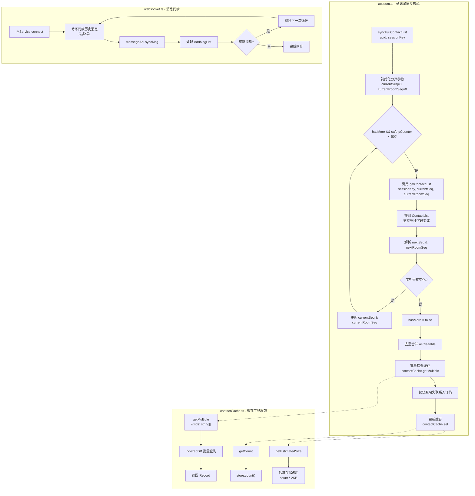

## 1. 高层摘要 (TL;DR)

*   **影响:** 🟡 **中等** - 重构了通讯录同步机制，从单次请求改为分页循环获取，增强了缓存工具的功能
*   **关键变更:**
    *   ✨ **通讯录同步重构**: 实现了基于序列号（Seq）的分页循环获取，支持大规模联系人列表
    *   ✨ **缓存批量操作**: 新增 `getMultiple()`、`getCount()` 等批量查询方法
    *   🐛 **消息同步优化**: WebSocket历史消息同步改为循环获取，最多5次确保完整性
    *   🧹 **文档整理**: 重命名 `swagger_utf8.json` → `api_utf8.json`

---

## 2. 可视化概览 (代码与逻辑图)



---

## 3. 详细变更分析

### 📦 组件一：Account Store (通讯录同步核心)

**文件:** `iwe-web/src/store/account.ts`

**变更说明:**

| 方面 | 旧逻辑 | 新逻辑 |
|------|--------|--------|
| **请求方式** | 单次请求 `getContactList(sessionKey, 0, 0)` | 循环分页请求，使用 `currentSeq` 和 `currentRoomSeq` 追踪进度 |
| **数据提取** | 简单判断数组/对象 | 支持多层嵌套结构（`ContactList.MemberList`、`UserNameList` 等） |
| **去重** | 无去重机制 | 使用 `Set` 对 `allCleanIds` 进行去重 |
| **缓存检查** | 无缓存检查 | 批量检查缓存，仅获取缺失的联系人详情 |
| **安全机制** | 无安全限制 | 添加 `safetyCounter < 50` 防止无限循环 |

**关键代码逻辑:**

```typescript
// 分页循环获取联系人
while (hasMore && safetyCounter < 50) {
  const res = await messageApi.getContactList(sessionKey, currentSeq, currentRoomSeq);
  
  // 提取序列号
  const nextSeq = data.CurrentWxcontactSeq || ...;
  const nextRoomSeq = data.CurrentChatRoomContactSeq || ...;
  
  // 判断是否继续
  if ((nextSeq === currentSeq && nextRoomSeq === currentRoomSeq) || 
      (nextSeq === 0 && nextRoomSeq === 0)) {
    hasMore = false;
  }
  
  currentSeq = nextSeq;
  currentRoomSeq = nextRoomSeq;
}

// 批量缓存检查
const cached = await contactCache.getMultiple(batch);
const missingIds = batch.filter(id => !cached[id]);
```

---

### 💾 组件二：Contact Cache (缓存工具增强)

**文件:** `iwe-web/src/utils/contactCache.ts`

**新增方法:**

| 方法名 | 功能描述 | 返回类型 |
|--------|----------|----------|
| `getMultiple(wxids: string[])` | 批量获取联系人详情 | `Promise<Record<string, any>>` |
| `getCount()` | 获取缓存中联系人数量 | `Promise<number>` |
| `getEstimatedSize()` | 估算缓存存储占用 | `Promise<string>` (如 "2.5 MB") |

**改进方法:**

| 方法 | 改进点 |
|------|--------|
| `set(wxid, detail)` | 添加参数验证（`!wxid || typeof wxid !== 'string'`）<br>添加错误处理回调 |

**关键代码片段:**

```typescript
// 批量查询实现
async getMultiple(wxids: string[]) {
  const results: Record<string, any> = {};
  let count = 0;
  
  wxids.forEach(wxid => {
    const request = store.get(wxid);
    request.onsuccess = () => {
      if (request.result) {
        results[wxid] = request.result.detail;
      }
      count++;
      if (count === wxids.length) resolve(results);
    };
  });
}

// 存储大小估算
async getEstimatedSize() {
  const count = await this.getCount();
  const sizeInBytes = count * 2048; // 假设每个联系人 2KB
  return formatSize(sizeInBytes);
}
```

---

### 🔌 组件三：WebSocket Service (消息同步优化)

**文件:** `iwe-web/src/utils/websocket.ts`

**变更说明:**

| 方面 | 旧逻辑 | 新逻辑 |
|------|--------|--------|
| **同步次数** | 单次调用 `syncMsg(key, 0)` | 循环调用，最多5次 |
| **消息提取** | `res.AddMsgList` | 支持多种路径：`res?.AddMsgList \|\| res?.Data?.AddMsgList` |
| **日志记录** | 无详细日志 | 添加同步进度日志 |

**关键代码:**

```typescript
let hasMore = true;
let syncCount = 0;
while (hasMore && syncCount < 5) {
  const res = await messageApi.syncMsg(key, 0);
  const msgList = res?.AddMsgList || res?.Data?.AddMsgList || [];
  
  if (msgList.length > 0) {
    console.log(`[${this.accountUuid}] 同步到 ${msgList.length} 条消息`);
    msgList.forEach((m) => this.onMessageCallback(m));
    syncCount++;
  } else {
    hasMore = false;
  }
}
```

---

### 📄 组件四：配置文件清理

| 文件 | 操作 | 说明 |
|------|------|------|
| `swagger_utf8.json` | 删除 | 旧版API文档 |
| `api_utf8.json` | 新建 | 新版API文档（内容基本相同） |
| `.gitignore` | 修改 | 重复添加 `node_modules/`（可能是格式化问题） |

---

## 4. 影响与风险评估

### ⚠️ 潜在风险

| 风险项 | 严重程度 | 说明 | 缓解措施 |
|--------|----------|------|----------|
| **无限循环** | 🟡 中等 | 虽然有 `safetyCounter < 50` 限制，但如果API返回异常序列号可能导致循环 | 已添加安全计数器和日志监控 |
| **内存占用** | 🟡 中等 | 大规模通讯录（如10万+联系人）可能导致 `allCleanIds` 数组过大 | 已使用批量处理（50条/批）和缓存检查 |
| **API兼容性** | 🟢 低 | 支持多种字段变体，向后兼容 | - |

### 🧪 测试建议

1. **通讯录同步测试:**
   - ✅ 测试小规模通讯录（< 100人）- 验证单次获取
   - ✅ 测试中等规模通讯录（100-1000人）- 验证分页逻辑
   - ✅ 测试大规模通讯录（> 1000人）- 验证循环和去重
   - ✅ 测试空通讯录 - 验证边界处理

2. **缓存功能测试:**
   - ✅ 验证 `getMultiple()` 批量查询性能
   - ✅ 验证 `getEstimatedSize()` 估算准确性
   - ✅ 验证无效 wxid 的参数验证

3. **WebSocket 测试:**
   - ✅ 验证历史消息同步完整性
   - ✅ 验证5次循环限制是否生效

4. **性能监控:**
   - 📊 监控 `syncFullContactList` 执行时间
   - 📊 监控 IndexedDB 存储大小增长

---

## 5. 总结

本次变更主要优化了 **通讯录同步** 和 **消息同步** 的核心逻辑，通过分页循环获取和缓存批量操作，显著提升了大规模数据场景下的性能和可靠性。新增的缓存工具方法（`getMultiple`、`getCount`、`getEstimatedSize`）为后续优化提供了更好的可观测性。

**建议:** 在生产环境部署前，重点测试大规模通讯录场景下的同步性能和内存占用情况。